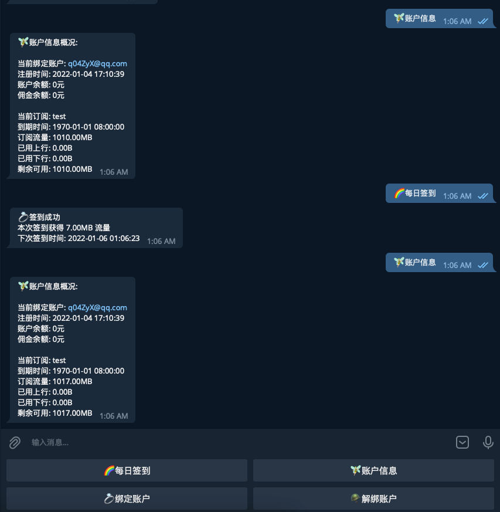

# v2board 签到机器人

```
免责声明:
此库 Fork 自 MiyaUU 删库后的一个 Fork 版本进行修改, 不保证任何可用性。
有问题，提issue，我也不一定会看（
```

### 注意
```
只能私信使用，不要拉到群里
可独立部署，另外申请一个bot即可，不与官方设置BOT冲突，可以两个一起用。
```
#

<details>
<summary> 展开查看预览</summary>


</details>

## 如何使用它?

### 使用二进制文件部署(无需修改内容)

```shell
# 下载
将版本压缩包clone 到你的服务器

# 修改配置文件
修改 uuBot.yaml 配置

# 机器人配置
bot:
  name: "MiyaUU Bot"      # 机器人名称,回复信息时使用
  token: "5036:AAEhtXJJW" # 机器人Token @BotFather 申请
  byte: 1024              # 签到可获取的最大值流量,不能奸商模式🔨  单位是MB 1024 为 最多1GB
  
# 数据库配置
database:
  host: "localhost"        # 数据库地址 本地 或 ip
  port: 3306               # 数据库端口
  name: "v2board"          # 数据库名称
  username: "root"         # 数据库用户名
  password: "123123123"    # 数据库密码
```
